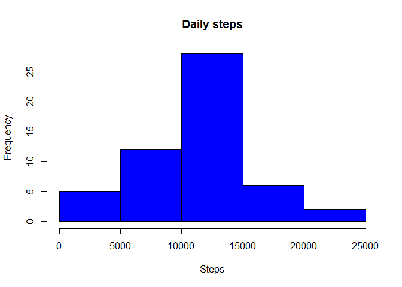
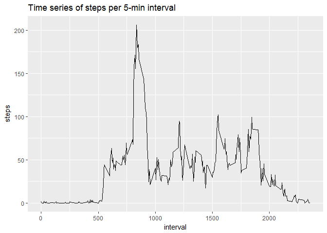
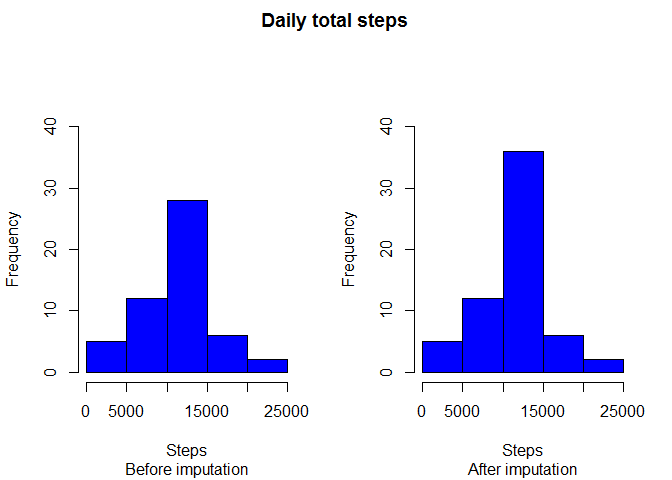
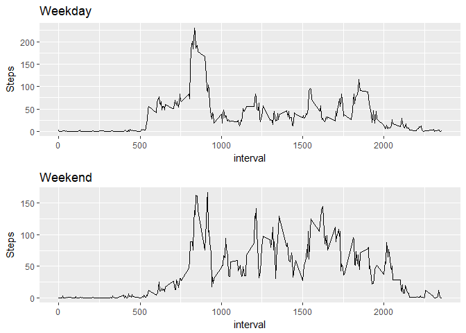

# Reproducible Research: Peer Assessment 1

Jingting Lu  

## Loading and preprocessing the data

```r
if(!file.exists('activity.csv')){
    unzip('activity.zip')
}
act <- read.csv('activity.csv', header = TRUE)
act$date <- strptime(act$date, "%Y-%m-%d")
```


## What is mean  total number of steps taken per day?
Calculate the total number of steps taken per day

```r
dailysum<-aggregate(steps ~ as.character(date), data = act, FUN = sum, na.rm = TRUE)
```

Create a histogram 

```r
hist(dailysum$steps, col = "blue",main = "Daily steps", xlab = "Steps")
```

<!-- -->

Calculate and report mean and median of steps per day

```r
paste("Daily mean of steps is", mean(dailysum$steps))
```

```
## [1] "Daily mean of steps is 10766.1886792453"
```

```r
paste("Daily median of steps is", median(dailysum$steps))
```

```
## [1] "Daily median of steps is 10765"
```


## What is the average daily activity pattern?
Make a time series plot (i.e. type = "l") of the 5-minute interval (x-axis) and the average number of steps taken, averaged across all days (y-axis)

```r
library(ggplot2)
intervalmean<-aggregate(steps ~ interval, data = act, FUN = mean, na.rm = TRUE)
qplot(interval, steps,data = intervalmean, geom = "line", main =  "Time series of steps per 5-min interval")
```

<!-- -->

### Which interval has the largest steps?


```r
intervalmean$interval[which.max(intervalmean$steps)]
```

```
## [1] 835
```


## Imputing missing values
Calculate and report the total number of missing values in the dataset (i.e. the total number of rows with NAs)

```r
sum(is.na(act$steps))
```

```
## [1] 2304
```

The strategy for filling in all of the missing values in the dataset is to use the mean for the 5-minute interval.

```r
names(intervalmean)[2] <- "interval_avg_steps"
merged <- merge(act, intervalmean, by = "interval")
merged$steps[is.na(merged$steps)]<-merged$interval_avg_steps[is.na(merged$steps)]
merged$interval_avg_steps<- NULL
```


```r
dailysum2<-aggregate(steps ~ as.character(date), data = merged, FUN = sum, na.rm = TRUE)
par(mfrow = c(1,2), oma = c(0,0,2,0))
hist(dailysum$steps, sub = "Before imputation", main ="", col = "blue", xlab = "Steps",ylim = c(0,40))
hist(dailysum2$steps, sub = "After imputation", main = "", col = "blue", xlab = "Steps",ylim = c(0,40))
title("Daily total steps", outer = TRUE)
```

<!-- -->
Calculate new mean and median

```r
paste("The new daily mean is ", round(mean(dailysum2$steps)))
```

```
## [1] "The new daily mean is  10766"
```

```r
paste("The new daily median is ", round(median(dailysum2$steps)))
```

```
## [1] "The new daily median is  10766"
```

## Are there differences in activity patterns between weekdays and weekends?
Create a new factor variable in the dataset with two levels - "weekday" and "weekend" indicating whether a given date is a weekday or weekend day.

```r
merged$isweekday <- ifelse(weekdays(strptime(merged$date,"%Y-%m-%d")) %in% c("Saturday","Sunday"), "Weekend","Weekday")
```


Make a panel plot containing a time series plot (i.e. type = "l") of the 5-minute interval (x-axis) and the average number of steps taken, averaged across all weekday days or weekend days (y-axis). See the README file in the GitHub repository to see an example of what this plot should look like using simulated data.


```r
library(ggplot2)
library(grid)
library(gridExtra)
intervalmeanwd <- aggregate(steps ~ interval, data = merged[merged$isweekday == "Weekday",], FUN = mean, na.rm = TRUE)
intervalmeanwe<- aggregate(steps ~ interval, data = merged[merged$isweekday == "Weekend",], FUN = mean, na.rm = TRUE)
p1<- qplot(interval, steps, geom = "line", data = intervalmeanwd, main = "Weekday",ylab = "Steps")
p2<- qplot(interval, steps, geom = "line", data = intervalmeanwe, main = "Weekend",ylab = "Steps")
grid.arrange(p1,p2, ncol = 1)
```

<!-- -->

